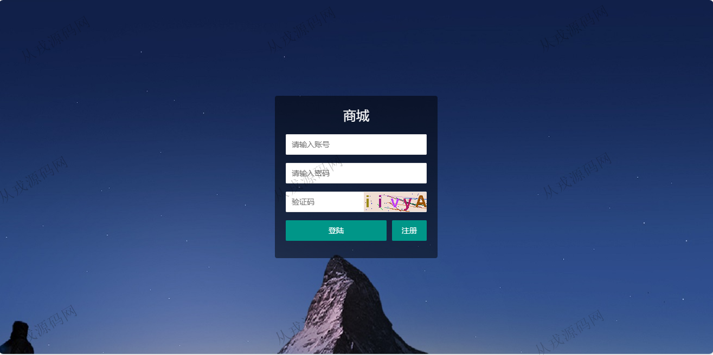
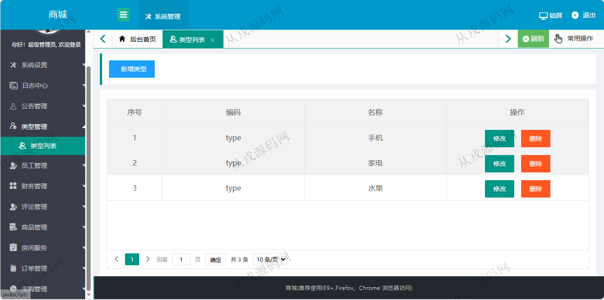
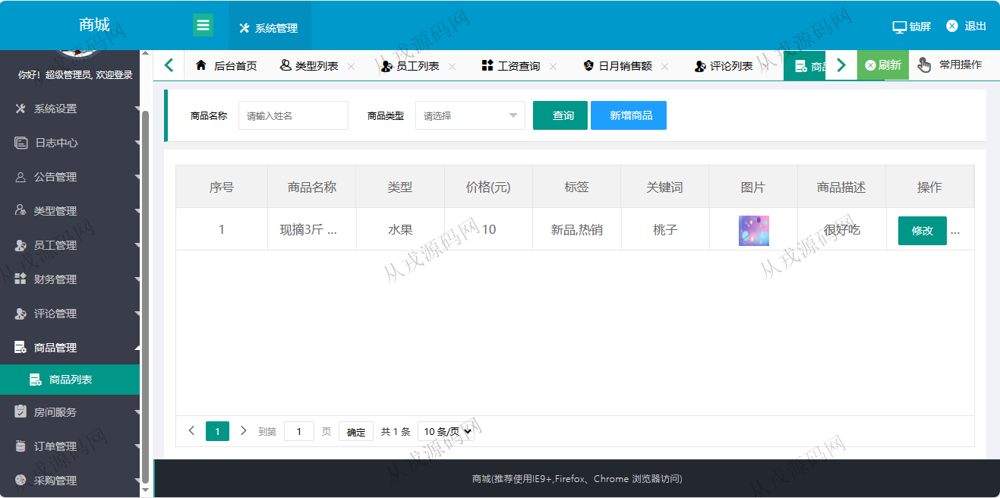
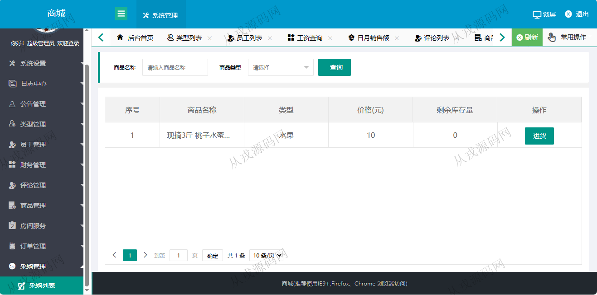
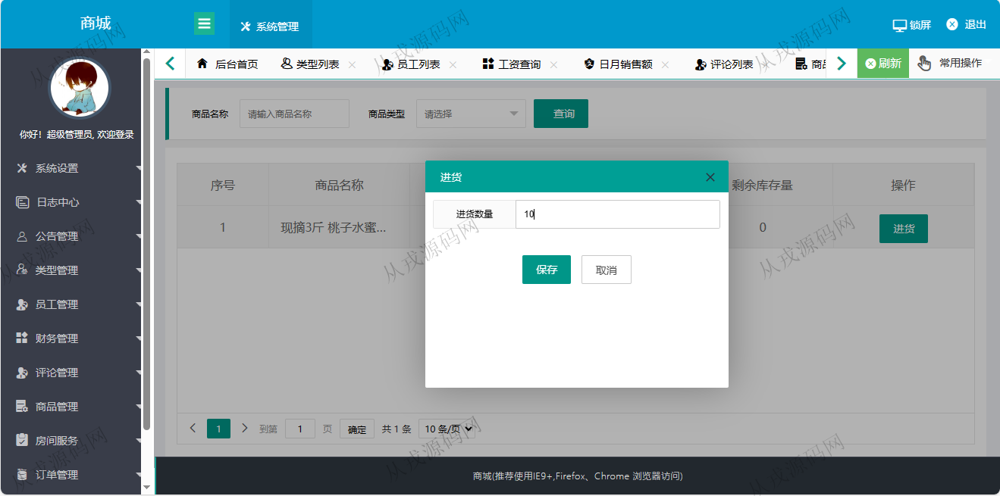
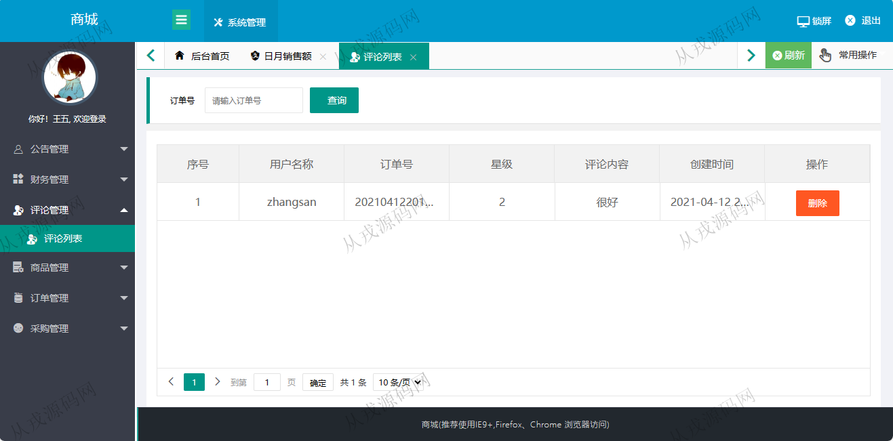
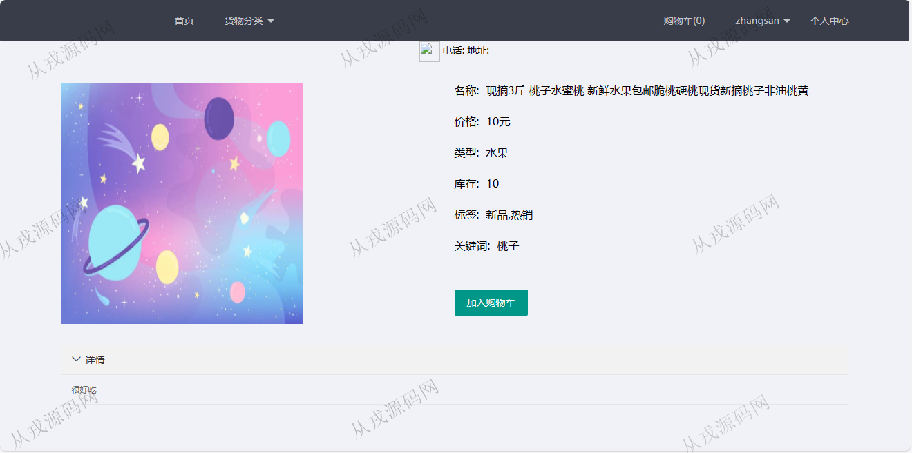
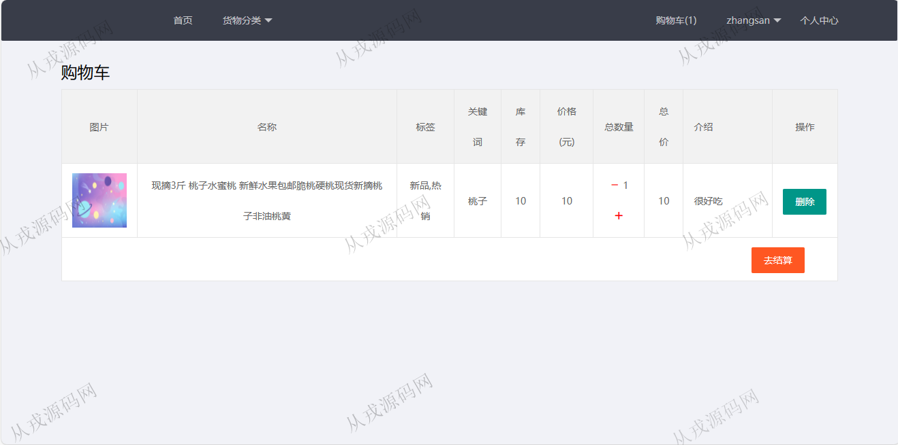
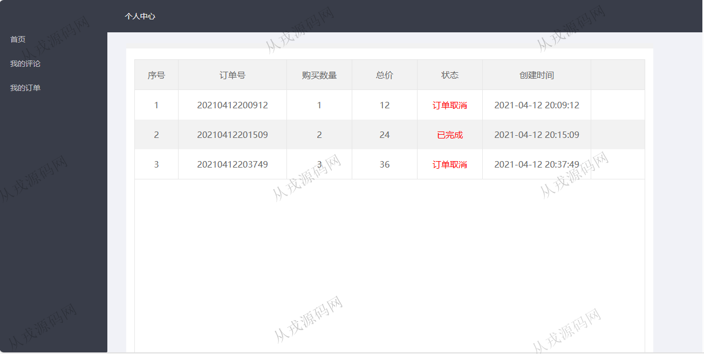

<h1 align="center">80.商城后台管理系统</h1>

- <b>完整代码获取地址：从戎源码网 ([https://armycodes.com/](https://armycodes.com/))</b>
- <b>技术探讨、资料分享，请加QQ群：692619798</b> 
- <b>作者微信：19941326836  QQ：952045282</b> 
- <b>承接计算机毕业设计、Java毕业设计、Python毕业设计、深度学习、机器学习</b>
- <b>选题+开题报告+任务书+程序定制+安装调试+论文+答辩ppt 一条龙服务</b>
- <b>所有选题地址 ([https://github.com/YuLin-Coder/AllProjectCatalog](https://github.com/YuLin-Coder/AllProjectCatalog)) </b>

## 项目介绍
基于springboot的商城后台管理系统：前端 jsp、jquery、layui，后端 maven、springmvc、spring、mybatis，集成商城前台和后台系统，商品发布，财务管理，公告管理，商品浏览，购物车，结算等功能于一体的系统。

## 功能介绍

### 用户

- 基本功能：登录、注册、退出、个人信息查看和修改，密码修改
- 商城首页：导航栏，分类导航，轮播图，商品列表展示
- 商品购买：商品详情，加入购物车，购物车页面，结算
- 我的订单：订单列表查看
- 我的评论：查看自己发出去的评论信息，删除评论

### 管理员

- 系统设置：用户管理的增删改查，角色管理的增删改查，菜单管理的增删改查
- 日志管理：日志信息的查看，导出
- 公告管理：公告信息的增删改查，关键词搜索
- 类型管理：类型管理的增删改查
- 日月销售额：可以按日和月统计查看销售额情况
- 评论管理：评论列表查询，评论信息删除，关键词查询
- 商品管理：商品信息的增删改查，商品图片上传，内容富文本编辑
- 订单管理：订单列表，根据订单号搜索，订单详情，订单删除
- 采购管理：采购列表查询，进货操作
- 锁屏：一键锁屏，输入密码解锁屏幕

### 商家

- 公告管理：公告列表查询，公告详情
- 日月销售额：可以按日和月统计查看销售额情况
- 评论管理：评论列表查询，评论信息删除，关键词查询
- 商品管理：商品信息的增删改查，商品图片上传，内容富文本编辑
- 订单管理：订单列表，根据订单号搜索，订单详情，订单删除
- 采购管理：采购列表查询，进货操作

## 环境

- <b>IntelliJ IDEA 2021.3</b>

- <b>Mysql 5.7.26</b>

- <b>JDK 1.8</b>

## 运行截图

